> I vibe coded a file transfer program. Surely it is secure...

# Overview

We received a network capture and an elf called `sft`:

```sh
capture.pcap: pcap capture file, microsecond ts (little-endian) - version 2.4 (Ethernet, capture length 262144)
sft:          ELF 64-bit LSB pie executable, x86-64, version 1 (SYSV), dynamically linked, interpreter /lib64/ld-linux-x86-64.so.2, BuildID[sha1]=641c
```

The network capture itself does not seem interesting, as it only contains traffic between two endpoint which in turn only pass TCP traffic.

```sh
❯ tshark -r capture.pcap -q -z endpoints,ip
================================================================================
IPv4 Endpoints
Filter:<No Filter>
                       |  Packets  | |  Bytes  | | Tx Packets | | Tx Bytes | | Rx Packets | | Rx Bytes |
51.15.211.189                 55         88151         30           44245          25           43906   
51.158.179.166                55         88151         25           43906          30           44245   
================================================================================
❯ tshark -r capture.pcap -q -z io,phs
===================================================================
Protocol Hierarchy Statistics
Filter: 

eth                                      frames:55 bytes:88151
  ip                                     frames:55 bytes:88151
    tcp                                  frames:55 bytes:88151
      data                               frames:33 bytes:86683
===================================================================
```

# Reversing the binary

The binary has a simple interface:


We can either

- Send some data as a client
- Receive some data as a server

However, we can also notice the `sodium_init()` call at the top. [Libsodium](https://doc.libsodium.org/) is a `modern, easy-to-use software library for encryption, decryption, signatures, password hashing, and more.` First, we look at the path to receive data aka `receive`. I already annotated and renamed everything given the libsodium documentation. The functions `read` and `send` are general purpose functions that work with a file description which is a socket here.

```c
int64_t receive(char* output_file)
    void* fsbase
    int64_t rax = *(fsbase + 0x28)
    printf(format: "[SERVER] Starting secure file transfer server on port %d\n", 0x539)
    int32_t SOCKET = socket(2, 1, 0)
    
    if (SOCKET s< 0)
        ERROR("socket failed")
        noreturn
    
    int32_t var_114 = 1
    setsockopt(zx.q(SOCKET), 1, 2, &var_114, 4)
    struct sockaddr var_d8
    __builtin_memset(dest: &var_d8, ch: 0, count: 0x10)
    var_d8.sa_family = 2
    var_d8.sa_data[2] = 0
    var_d8.sa_data[3] = 0
    var_d8.sa_data[4] = 0
    var_d8.sa_data[5] = 0
    uint16_t rax_3 = htons(x: 0x539)
    var_d8.sa_data[0] = rax_3.b
    var_d8.sa_data[1] = rax_3:1.b
    
    if (bind(zx.q(SOCKET), &var_d8, 0x10, &var_d8) s< 0)
        ERROR("bind failed")
        noreturn
    
    if (listen(zx.q(SOCKET), 1) s< 0)
        ERROR("listen failed")
        noreturn
    
    puts(str: "[SERVER] Waiting for connection...")
    int32_t CONNECTION = accept(fd: SOCKET, addr: 0, len: nullptr)
    
    if (CONNECTION s< 0)
        ERROR("accept failed")
        noreturn

    puts(str: "[SERVER] Client connected! Performing key exchange...")
    void serverPK
    read(socket: CONNECTION, resultBuffer: &serverPK, size: 0x20)
    void clientPK
    void clientSK
    crypto_kx_keypair(&clientPK, &clientSK, &clientSK)
    send(socket: CONNECTION, inputBuffer: &clientPK, size: 0x20)
    void clientTX
    void clientRX
    crypto_kx_server_session_keys(&clientRX, &clientTX, &clientPK, &clientSK, &serverPK)
    int64_t blockCounterReceiving = 0
    int64_t blockCounterSending = 0

    puts(str: "[SERVER] Key exchange complete. Receiving encrypted file...")
    void ciphertextFileLength
    read(socket: CONNECTION, resultBuffer: &ciphertextFileLength, size: 8)
    uint64_t plaintextFileLength
    // Receive the file size, 8 bytes
    chchcha(ciphertext: &plaintextFileLength, plaintext: &ciphertextFileLength, length: 8, 
        key: &clientTX, nonce: &clientRX, blockCounterIC: &blockCounterSending)
    printf(format: "[SERVER] File length: %lu bytes\n", plaintextFileLength)
    ssize_t ciphertextFileData = malloc(bytes: plaintextFileLength)
    read(socket: CONNECTION, resultBuffer: ciphertextFileData, size: plaintextFileLength)
    int64_t plaintextFileData = malloc(bytes: plaintextFileLength)
    // Receive the file content
    chchcha(ciphertext: plaintextFileData, plaintext: ciphertextFileData, 
        length: plaintextFileLength, key: &clientTX, nonce: &clientRX, 
        blockCounterIC: &blockCounterSending)
    FILE* localfile = fopen(filename: output_file, mode: "wb")
    
    if (localfile == 0)
        ERROR("fopen failed")
        noreturn
    
    // Write the file size
    fwrite(buf: plaintextFileData, size: 1, count: plaintextFileLength, fp: localfile)
    fclose(fp: localfile)
    printf(format: "[SERVER] File written to %s. Sending back encrypted file...\n", output_file)
    // Send the whole data which was received back - catch: Other IC now used
    chchcha(ciphertext: ciphertextFileData, plaintext: plaintextFileData, 
        length: plaintextFileLength, key: &clientTX, nonce: &clientRX, 
        blockCounterIC: &blockCounterReceiving)
    send(socket: CONNECTION, inputBuffer: ciphertextFileData, size: plaintextFileLength)
    void ciphertextTransferStatus
    read(socket: CONNECTION, resultBuffer: &ciphertextTransferStatus, size: 1)
    char transferStatus
    chchcha(ciphertext: &transferStatus, plaintext: &ciphertextTransferStatus, length: 1, 
        key: &clientTX, nonce: &clientRX, blockCounterIC: &blockCounterSending)
    
    if (transferStatus != 0)
        puts(str: "[SERVER] Transfer failed!")
    else
        puts(str: "[SERVER] Transfer successful!")
    
    free(mem: ciphertextFileData)
    free(mem: plaintextFileData)
    close(fd: CONNECTION)
    close(fd: SOCKET)
    
    if (rax == *(fsbase + 0x28))
        return rax - *(fsbase + 0x28)
    
    __stack_chk_fail()
    noreturn
```

## Cryptographic analysis

Basically, the code establishes a shared secret between two parties via some public crypto. Two session keys `clientTX` and `clientRX` are returned which should be used for **transmitting** and **receiving**. Then, the server receives the encrypted file length followed by the encrypted file itself. After, the server will decrypt the file, save it into a file, and encrypt & send it back. At the end, the client will tell if the transfer was successful. In the diagram, `ciphertext` is the output buffer and `plaintext` the input buffer. We are **decrypting** in case their roles are switched.

```mermaid
sequenceDiagram
    participant Client
    participant Server
    participant Libsodium

    Client->>Server: send 32-byte serverPK

    Note over Server,Libsodium: Keypair generation
    Server->>Libsodium: crypto_kx_keypair(clientPK, clientSK)
    Libsodium-->>Server: clientPK (32 bytes), clientSK (32 bytes)

    Server->>Client: send 32-byte clientPK

    Note over Server,Libsodium: Derive session keys (server role)
    Server->>Libsodium: crypto_kx_server_session_keys(<br/> clientRX, clientTX, <br/> clientPK, clientSK, serverPK)
    Libsodium-->>Server: clientRX (nonce material, 32 bytes), clientTX (session key, 32 bytes)

    rect rgba(255,240,240,0.6)
    Client->>Server: send 8-byte ciphertext (encrypted file length)
    end

    Note over Server,Libsodium: Decrypt file length
    Server->>Libsodium: crypto_stream_xchacha20_xor_ic(<br/> ciphertext = plaintextFileLength, <br/> plaintext = ciphertextFileLength, <br/> length = 8 (0x08), <br/> nonce =clientRX, <br/> ic = blockCounterSending (initially 0), <br/> key = clientTX)
    Libsodium-->>Server: plaintext = file length (uint64)
    Note over Server: blockCounterSending += ceil(8/64) = 1 → now 1

    rect rgba(255,240,240,0.6)
    Client->>Server: send ciphertextFileData (plaintextFileLength bytes)
    end

    Note over Server,Libsodium: Decrypt file data
    Server->>Libsodium: crypto_stream_xchacha20_xor_ic(<br/> ciphertext = plaintextFileData, <br/> plaintext = ciphertextFileData, <br/> length = plaintextFileLength, <br/> nonce = clientRX, <br/> ic = blockCounterSending (currently 1), <br/> key = clientTX)
    Libsodium-->>Server: plaintextFileData
    Note over Server: blockCounterSending += ceil(plaintextFileLength/64)

    Note over Server: Write plaintextFileData into output_file

    Note over Server,Libsodium: Encrypt file to send back (separate IC)
    Server->>Libsodium: crypto_stream_xchacha20_xor_ic(<br/> ciphertext = ciphertextFileData, <br/> plaintext = plaintextFileData, <br/> length = plaintextFileLength, <br/> nonce = clientRX, <br/> ic = blockCounterReceiving (initially 0), <br/> key = clientTX)
    Libsodium-->>Server: ciphertext (to send back)
    Note over Server: blockCounterReceiving += ceil(ciphertextFileData/64)

    rect rgba(240,240,255,0.6)
    Server->>Client: send encrypted file (plaintextFileLength bytes)
    end

    rect rgba(255,240,240,0.6)
    Client->>Server: send 1-byte ciphertext (transfer status)
    end
    
    Note over Server,Libsodium: Decrypt 1-byte transfer status
    Server->>Libsodium: crypto_stream_xchacha20_xor_ic(<br/> ciphertext = transferStatus, <br/> plaintext = ciphertextTransferStatus, <br/> length = 1 (0x01), <br/> nonce = clientRX, <br/> ic = blockCounterSending (after file data), <br/> key = clientTX)
    Libsodium-->>Server: transferStatus (0 == ok)
    Note over Server: blockCounterSending += ceil(1/64) = 1
```



First, we quickly present what the functions do according to the documentation and the jump straight to the big problem in the code:

```c
int crypto_kx_keypair(unsigned char pk[crypto_kx_PUBLICKEYBYTES],
                      unsigned char sk[crypto_kx_SECRETKEYBYTES]);

/*
The crypto_kx_keypair() function creates a new key pair. It puts the public key into pk and the secret key into sk.
*/

int crypto_kx_server_session_keys(unsigned char rx[crypto_kx_SESSIONKEYBYTES],
                                  unsigned char tx[crypto_kx_SESSIONKEYBYTES],
                                  const unsigned char server_pk[crypto_kx_PUBLICKEYBYTES],
                                  const unsigned char server_sk[crypto_kx_SECRETKEYBYTES],
                                  const unsigned char client_pk[crypto_kx_PUBLICKEYBYTES]);

/*
The crypto_kx_server_session_keys() function computes a pair of shared keys (rx and tx) using the server’s public key server_pk, the server’s secret key server_sk, and the client’s public key client_pk.

It returns 0 on success and -1 if the client’s public key is not acceptable.

The shared secret key rx should be used by the server to receive data from the client, whereas tx should be used for data flowing in the opposite direction.

rx and tx are both crypto_kx_SESSIONKEYBYTES bytes long. If only one session key is required, either rx or tx can be set to NULL.
*/

int crypto_stream_xchacha20_xor_ic(unsigned char *c, const unsigned char *m,
                                   unsigned long long mlen,
                                   const unsigned char *n, uint64_t ic,
                                   const unsigned char *k);

/*
The crypto_stream_xchacha20_xor_ic() function is similar to crypto_stream_xchacha20_xor() but adds the ability to set the initial value of the block counter to a non-zero value, ic.

This permits direct access to any block without having to compute the previous ones.

m and c can point to the same address (in-place encryption/decryption). If they don’t, the regions should not overlap.
*/
```

### Vulnerability

Alarms should ring when someone reuses a **nonce**! In our case, the nonce is set to the secret key for receiving data `clientRX`. In all subsequent calls to this function, the nonce is therefore always the same. Furthermore, the keys for receiving and transmitting data is **are the same**. The sender side however has the keys in different order to have a correct encryption scheme, i.e. both will encrypt with the same key but the key has a different name on each side.

```c
chchcha(ciphertext: &plaintextFileLength, plaintext: &ciphertextFileLength, length: 8, 
        key: &clientTX, nonce: &clientRX, blockCounterIC: &blockCounterSending)
```

### Exploitation strategy

However, to curb our enthusiasm, we also see the parameter `blockCounterIC` which modifies the counter which goes into the CHACHA construction to generate a keystream.

```c
int64_t* chchcha(int64_t ciphertext, int64_t plaintext, int64_t length, int64_t key, int64_t nonce, int64_t* blockCounterIC)

      crypto_stream_xchacha20_xor_ic(ciphertext, plaintext, length, nonce, *blockCounterIC, key, 
          blockCounterIC, nonce, key, length, plaintext, ciphertext)
      *blockCounterIC += (length + 0x3f) u>> 6
      return blockCounterIC
```

The image below, taken from [wikipedia](https://en.wikipedia.org/wiki/ChaCha20-Poly1305), explains how `chacha20` works. It generates a keystream which is then xored to the plaintext to generate a ciphertext. We do not have any authentiation in our code here, so we can ignore the `AD`part in the diagram below:


Actually, `chacha20` and `xchacha20` are not that different because `xchacha20` only modifies the `nonce` based on the `key` to support longer nonces. As the code always uses the same nonce and key, this is not a something to worry about. Checking out the [implementation](https://github.com/jedisct1/libsodium/blob/09e995c0c85a0026510704b8ce7f5867a09a3841/src/libsodium/crypto_stream/xchacha20/stream_xchacha20.c#L44C1-L54C2), we see the call to `chacha20`

```c
int
crypto_stream_xchacha20_xor_ic(unsigned char *c, const unsigned char *m,
                               unsigned long long mlen, const unsigned char *n,
                               uint64_t ic, const unsigned char *k)
{
    unsigned char k2[crypto_core_hchacha20_OUTPUTBYTES];

    crypto_core_hchacha20(k2, n, k, NULL);
    return crypto_stream_chacha20_xor_ic(
        c, m, mlen, n + crypto_core_hchacha20_INPUTBYTES, ic, k2);
}
```

Why is this counter annoying? Because we cannot directly xor out both keystream:

| Message              | Sender | Key      | Nonce    | Counter before      | Counter after       |
|----------------------|--------|----------|----------|---------------------|---------------------|
| File length (8B)     | Client | clientTX | clientRX | 0                   | 1                   |
| File data (N bytes)  | Client | clientTX | clientRX | 1                   | 1 + ceil(N/64)      |
| Echo file (N bytes)  | Server | clientTX | clientRX | 0                   | ceil(N/64)          |
| Transfer status (1B) | Client | clientTX | clientRX | 1 + ceil(N/64)      | 2 + ceil(N/64)      |

Also, the server which we focus in here, has two counters. One for sending, one for receiving. Therefore, they have a mismatch of 1. I won't cover the sending part as it is essentially the same. So what does this all mean: 

$$c_{File} = p_0 \oplus E_{k}(ibc=1) || p_1 \oplus E_{k}(ibc=2) || \dots \\  c_{Echo} = p_0 \oplus E_{k}(ibc=0) || p_1 \oplus E_{k}(ibc=1) || \dots$$

The key is always the same, but only `ibc` has a big impact here. Internally, the inital block counter `ibc` will be incremented in libsodium after $64$ bytes as `chacha` operates on $512$ bits. The function `chchcha` then modifies the respective block counter after encryption/decryption.

However, the cool thing is that we have a chaining here such that a keystream is in two parts! What happens if we ignore the first block of $c_{Echo}$ and xor everything? 

$$\begin{align*}c_{File} \oplus c_{Echo} &= p_0 \oplus E_{k}(ibc=1) \oplus p_1 \oplus E_{k}(ibc=1) || p_2 \oplus E_{k}(ibc=2) \oplus p_2 \oplus E_{k}(ibc=2) \dots \\ &= p_0 \oplus p_1 || p_1 \oplus p_2\dots\end{align*}$$

Therefore, we have a progression. To simplify the expression, we can rebase everything on $p_0$ with repeated xoring:

```python
send = list(batched(messages["FileData"],n=64))
recv = list(batched(messages["EchoData"],n=64))

canceled_keys = zip(
    send, # # p_0 xor E(1) | p_1 xor E(2) | ...
    recv[1:] # p_1 xor E(1) | p_2 xor E(2) | ...
)
canceled_keys = list(map(
    lambda comb: xor(comb[0],comb[1]),canceled_keys # p_0 XOR p_1 | p_1 xor p_2 | p_2 xor p_3
))

relativeP0 = [canceled_keys[0]] # p_0 xor p_1 || p_0 xor p_2 || p_0 xor p_3
for plaintexted_xor in canceled_keys[1:]:
    relativeP0.append(
        xor(relativeP0[-1],plaintexted_xor) # p_0 XOR p_1 xor p_1 xor p_2 = p_0 xor p_2
    )
```


Therefore, we end up with 

$$c_{File} \oplus c_{Echo} = p_0 \oplus p_1 || p_0 \oplus p_2 || \dots$$

Everything now boils down to $p_0$ which acts as a 64 byte secret key! Furthermore, it is plaintext such that we likely will have a guessing game now! We can recover this (not by force tho).

# Reconstructing messages

I exported the pcap conversation to YAML and build a parser around it 

```YAML
peers:
  - peer: 0
    host: 51.15.211.189
    port: 56734
  - peer: 1
    host: 51.158.179.166
    port: 1337
packets:
  - packet: 4
    peer: 0
    index: 0
    timestamp: 1754336181.579527000
    data: !!binary |
      9NLqC9Md03Q30UvbE7lTsd9crfXlfzXvKejUvN57EEk=
  - packet: 6
    peer: 1
    index: 0
    timestamp: 1754336181.579744000
    data: !!binary |
      IWLrBMBClnvb7usSVqxhAp8Y2+dyf6ZLF/9/pgh5Aw8=
    ....
```

Due to the nature of tcp, we need to reassemble the byte stream into packages. Therefore, we take as much data and call it a message when the code switches from sending to receiving or vice versa.

```python
def parse_conversation(filename):
    with open(filename, "r") as f:
        doc = yaml.safe_load(f)

    peers = {p["peer"]: (p["host"], p["port"]) for p in doc["peers"]}
    packets = sorted(doc["packets"], key=lambda p: p["packet"])

    messages = []
    current_data = bytearray()
    last_role = "client"
    
    for pkt in packets:
        peer_id = pkt["peer"] 
        role = "server" if pkt["peer"] == 1 else "client"
        data = pkt["data"]  # !!binary already gives bytes
        
        if role == last_role:
            # more data
            current_data = current_data + data
        else:
            # new role, add last chunk and advance
            messages.append((last_role,current_data))
            current_data = bytearray(data)
            last_role = role

    messages.append((role,current_data))
    return messages

data = parse_conversation("tcp0.yaml")
roles,data_chunks = list(zip(*data))

messages = {
    "ClientKeyExchange" : data_chunks[0],
    "ServerKeyExchange" : data_chunks[1],
    "FileLength" : data_chunks[2][:8], # RECV: IC=0 -> IC=1
    "FileData" : data_chunks[2][8:], # RECV: IC=1 -> IC=N+1
    "EchoData" : data_chunks[3], # SEND: IC=0 -> IC=N
    "TransferStatus" : data_chunks[4], # RFC IC=N+1 -> IC=N+2
}
```

# Plaintext guessing game

Now, our objective is to guess the $64$ starting bytes of the plaintext. My first try was to actually xor the file length and echo data message, as they both have the same keystream:

```python
xor(messages["FileLength"],messages["EchoData"])

> bytearray(b'a\xf4NG\r\n\x1a\n')
```

Damn, thats likely a PNG! PNGs have a [fairly stable structure and a standard](https://www.w3.org/TR/png-3/). Throughout the challenge, I used the [PNG file chunk inspector](https://www.nayuki.io/page/png-file-chunk-inspector) which was a great help! A PNG consists of chunks, which have a length, some data and a CRC32 at the end. I wrote a small script to deduct what information is available:

```python
plaintext = (64) * ["?"]

partial = (
    # PNG_header = b"\x89PNG\r\n\x1a\n" 
    (PNG_header,"X"),
    # IHDR_header = bytes.fromhex("00 00 00 0d 49 48 44 52") # SIZE|IHDR
    (IHDR_header,"X"),
    # WIDTH = bytes.fromhex("00 00 00 00") # WIDTH
    (WIDTH,"W"),
    # HEIGHT = bytes.fromhex("00 00 00 00") # HEIGHT
    (HEIGHT,"H"),
    # BITDEPTH = bytes.fromhex("00") # 1 byte, values are powers of to {1, 2, 4, 8, or 16}
    (BITDEPTH,"B"),
    # COLOR = bytes.fromhex("00") # 1 byte, values are {0, 2, 3, 4, or 6}, assuming RGB
    (COLOR,"C"),
    # CFI = bytes.fromhex("00 00 00") # compression, filter method, interlace method
    (CFI,"X"),
    # CRC = bytes.fromhex("00 00 00") # CRC32 over tag + data
    (CRC,"Z"),
)

last = 0
for info,status in partial:
    marker = (status) * len(info) 
    plaintext[last:last+len(info)] = marker
    last += len(info) 

> "XXXXXXXXXXXXXXXXWWWWHHHHBCXXXZZZZ???????????????????????????????"
```

- `?` is totally unknown
- `X` is known
- `W`,`H`,`B`,`C` needs guesswork
- `Z` is the CRC32 which could tell us if we are guessing right

## Recovering IHDR with IEND

How may we get the CRC32? A PNG contains the [IEND image trailer](https://www.w3.org/TR/png-3/#11IEND) which is always static AND has some bytes that let us recover the CRC!!! Now, we need to calculate backwards to reapply the known `IEND` to our $p_0$ plaintext:

```python
# Pure static information from the start
PNG_HEADER = b"\x89PNG\r\n\x1a\n"
IDHR_HEADER = bytes.fromhex("00 00 00 0d 49 48 44 52") # SIZE|IHDR
START_HEADER = PNG_HEADER + IDHR_HEADER

# compute the IEND part to apply that to relativeP0
IEND_HEADER = bytes.fromhex("00 00 00 00 49 45 4e 44 ae 42 60 82")# LENGTH|IEND|CRC of that
start_position = len(canceled_keys[-1]) - len(IEND_HEADER)
last = xor(canceled_keys[-1][start_position:start_position+len(IEND_HEADER)],IEND_HEADER)

for plaintexted_xor in canceled_keys[-2::-1]: # skip the last one and reverse
    last = xor(
        plaintexted_xor[start_position:start_position+len(IEND_HEADER)],
        last
    )

assert len(last) == len(IEND_HEADER)
assert start_position >  len(IDHR_HEADER)

# all unknown bytes are set to 0
p0Known = bytearray(b"\x00" * 64)
p0Known[:len(START_HEADER)] = xor(p0Known[:len(START_HEADER)],START_HEADER)
p0Known[start_position:start_position+len(IEND_HEADER)] = xor(p0Known[start_position:start_position+len(IEND_HEADER)],last)
```

With those bytes, we are way closer to recover the first 64 bytes fully, as all CRC bytes, denoted by `(ZZZZ)` are within known bytes (totally unintended...):

```
XXXXXXXXXXXXXXXXWWWWHHHHBCXXX(ZZZZ)XXXXXXX????????????????????????
```

## CRC32 calculations

I asked chatty to write me a script to brute force all unknown fields in the above string given the CRC32. The CRC32 in $p_0$ should start at bytes $29$ and is $4$ bytes long.
I added the constraint that the dimensions do not need to be bigger than `0xFFF` as the file is not big enough for that.
The second solution is invalid according to the standard, as `color_type` $4$ is a grayscale image that support $8$ or $16$ bits of bit depth.

```python
[*] Starting grid search for IHDR with target CRC: 67b15614
[+] Found matching candidate: {'width': 1920, 'height': 1080, 'bit_depth': 8, 'color_type': 2, 'ihdr_data': b'\x00\x00\x07\x80\x00\x00\x048\x08\x02\x00\x00\x00'}
[+] Found matching candidate: {'width': 2302, 'height': 2157, 'bit_depth': 4, 'color_type': 4, 'ihdr_data': b'\x00\x00\x08\xfe\x00\x00\x08m\x04\x04\x00\x00\x00'}
```

## Recovering iTXt

After setting the fields and applying $p_0$ to every chunk of my relative to $p_0$ data, I inspected the image:

{: width="60%" }

The start `iTX` looks suspiciously like `iTXt` which is the text section in a PNG! The [standard defines](https://www.w3.org/TR/png-3/#11tEXt) some easy bytes. However, we need to guess some values, i.e. the `Keyword`


I build a script to try every keyword from the standard. After, I saved every PNG hoping for the best

```python
p0KnowniTXT = bytearray(p0KnownWithIHDR) # recovered header with the CRC32 derived values
start_itxt = p0KnowniTXT.index(b"iTX")
crib = b"iTXt"

assert start_itxt == 33 + 4
p0KnowniTXT[start_itxt:start_itxt + len(crib)] = crib
start_itxt += len(crib)
assert start_itxt == 37 + 4 

# Lets try all keywords
keywords = [
    b"Title",
    b"Author",
    b"Description",
    b"Copyright",
    b"Creation",
    b"Software",
    b"Disclaimer",
    b"Warning",
    b"Source",
    b"Comment",
]

tests = []
for keyword in keywords:
    p0Keyword = bytearray(p0KnowniTXT)
    keyword += b"\x00" # mandatory null byte
    keyword += b"\x00" # compression flag
    keyword += b"\x00" # compression method
    keyword += b"\x00" # null sep
    # language tag maybe
    keyword += b"\x00" # null sep
    # translated keyword maybe
    keyword += b"\x00" # null sep
    p0Keyword[start_itxt:start_itxt + len(keyword)] = keyword
```

Obviously, none of the keywords was right. After I uploaded the PNG to the PNG file chunk inspector, I was greeted by `XML` in the `Text string` field:

```xml
?xpacket begin="" id="W5M0MpCehiHzreSzUvB-mb JC[QhYVBpmetaxmlns:x="adobe:ns:meta/" x:xmptk="XMP Cor~y3/)_nO^JW"DF xmPns:rdf="http://www.w3.org/1999/02/22-rdf-h[O#gy4@GM\oXQdf:DeOcription rdf:about="" xmlns:xmp="http! 9u/xJ LABap/1./" xmlns:photoshop="http://ns.adobe.ctO'nnmAJV]_" xmlns:exif="http://ns.adobe.com/exif/1.0/9(w&!aC XGM"http//ns.adobe.com/tiff/1.0/" xmlns:xmpMM&I#rq#N LJ.com/Dap/1.0/mm/" xmlns:stEvt="http://ns.adt@DyentMTHBType/nesourceEvent#" xmp:CreateDate="2025-08679#Y^\PNI]@" Dmp:ModifyDate="2025-08-04T20:30:53+01:00"w~li,O4ate="025-08-04T20:30:53+01:00" photoshop:DaoGb%c`mKYMPUM@@8-04T 8:18:32+0100" photoshop:ColorMode="3" ;'nnmA_g;. rofilY="sRGB IEC61966-2.1" exif:PixelXDimensrMOj$0 QFeBEf:PixYlYDimension="1080" exif:ColorSpace="1"wrhH[-K/th="120" tiff:ImageLength="1080" tiff:RehMM"rhv@4 XJOz tiZf:XResolution="72/1" tiff:YResolution=9x7#'$ADO^C =:HistSry> <rdf:Seq> <rdf:li stEvo@4rhv@\F J d"  stEvt:softwareAgent="Affinity Designer;e(77CnOBEXMtEvt:Khen="2025-08-04T20:30:53+01:00"/> </rDcp'$ADO^JV=M:HisHory> </rdf:Description> </rdf:RDF> </x!ZL'kdmO_nS]^et enX="r"?>
```

Gotcha, this seems like made in `photoshop`. Putting the XML gibberish into gemini and chatty to ask for a right keyword type, gemini recommended `XML:com.adobe.xmp`. However, I still had to guess the last character `<` for XML start.

The final $p_0$ is `\x89PNG\r\n\x1a\n\x00\x00\x00\rIHDR\x00\x00\x07\x80\x00\x00\x048\x08\x02\x00\x00\x00g\xb1V\x14\x00\x00\x05\x1diTXtXML:com.adobe.xmp\x00\x00\x00\x00\x00<`. If we apply that to all relative to $p_0$ byte blocks, I end up with a **valid** PNG:


# Mitigation

- Always generate a fresh nonce for the current connection
- Have seperate keys for sending and receiving data